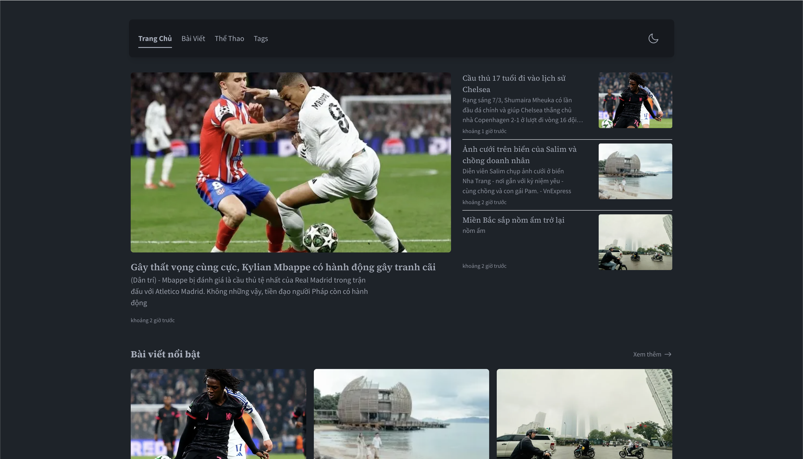

## Giới thiệu dự án

Dự án này là một website tin tức được xây dựng bằng Astro, được thiết kế để cung cấp trải nghiệm đọc tin tức hiện đại và responsive.

## 🌐 Demo

Explore the live demo here: [**Live Demo**](https://hottrending.asia/)

## Cấu trúc dự án

### Cấu trúc thư mục chính

Repository có cấu trúc thư mục như sau:

- **src/**: Chứa source code chính của ứng dụng
- **Dockerfile**: File cấu hình Docker cho việc containerization
- **package.json**: File cấu hình npm với các dependencies và scripts
- **tailwind.config.ts**: File cấu hình Tailwind CSS
- **postcss.config.js**: File cấu hình PostCSS

### Cấu trúc thư mục src/

Trong thư mục src/ bao gồm:

- **assets/**: Chứa các tài nguyên tĩnh
- **components/**: Chứa các React/Astro components
- **content/**: Chứa nội dung markdown/MDX
- **layouts/**: Chứa các layout templates
- **lib/**: Chứa các utility functions
- **pages/**: Chứa các trang của website

### Cấu trúc trang web

Website được tổ chức theo cấu trúc tiếng Việt với các route:

- **bai-viet/**: Chứa các bài viết
- **danh-muc/**: Chứa các danh mục tin tức
- **tags/**: Chứa các trang tag

## Công nghệ sử dụng

### Framework và Runtime

- **Astro v5.3.0**: Framework chính để xây dựng static site
- **Node.js**: Runtime environment
- **TypeScript**: Ngôn ngữ lập trình chính

### Frontend Technologies

- **React 19.0.0**: Library UI components
- **Tailwind CSS 3.4.15**: Framework CSS utility-first
- **DaisyUI 4.12.14**: Thư viện component cho Tailwind CSS
- **@tailwindcss/typography**: Plugin typography cho Tailwind

### Content Management

- **MDX 4.0.2**: Hỗ trợ Markdown với JSX
- **Astro Content Collections**: Quản lý nội dung structured

### SEO và Performance

- **@astrojs/sitemap**: Tự động tạo sitemap
- **@astrojs/rss**: Tạo RSS feed
- **Sharp**: Tối ưu hóa hình ảnh

### Search và Navigation

- **Pagefind**: Công cụ tìm kiếm static
- **astro-pagefind**: Integration Pagefind cho Astro

### Utilities

- **date-fns & dayjs**: Xử lý ngày tháng
- **reading-time**: Tính thời gian đọc bài viết
- **cheerio**: Parsing HTML

## Tính năng chính và ưu điểm

### Tính năng đã triển khai

- **Content Layer**: Quản lý nội dung có cấu trúc
- **Navigation**: Hệ thống điều hướng responsive
- **Responsive Design**: Thiết kế thích ứng mọi thiết bị
- **Pagination**: Phân trang tự động
- **Search Functionality**: Tính năng tìm kiếm
- **RSS Feed**: Cung cấp RSS feed
- **Sitemap**: Tự động tạo sitemap
- **Dark Mode**: Chế độ tối
- **SEO Optimization**: Tối ưu hóa SEO

### Ưu điểm công nghệ

#### Performance

- **Static Site Generation**: Tốc độ tải trang nhanh nhờ pre-build
- **Image Optimization**: Tối ưu hình ảnh tự động với Sharp
- **Modern Build Tools**: Sử dụng Astro 5.0 với performance tối ưu

#### Developer Experience

- **TypeScript**: Type safety và IntelliSense tốt hơn
- **Hot Reload**: Development server với hot reload
- **Modern CSS**: Tailwind CSS với utility-first approach
- **Component-based**: Architecture dựa trên components

#### SEO và Accessibility

- **Automatic Sitemap**: Tự động tạo sitemap cho search engines
- **RSS Support**: Hỗ trợ RSS feed cho subscribers
- **Semantic HTML**: Cấu trúc HTML semantic
- **Dark Mode Support**: Hỗ trợ chế độ tối cho user experience tốt hơn

## Cấu hình Docker

Dự án được containerized với multi-stage Docker build:

- **Stage 1 (Builder)**: Build ứng dụng Astro
- **Stage 2 (Runner)**: Chạy ứng dụng trong production

## Hướng dẫn cài đặt

### Các bước cài đặt cơ bản

1. **Clone repository**
2. **Cài đặt dependencies**
3. **Chạy development server**
4. **Build cho production**

### Scripts có sẵn

- `dev/start`: Chạy development server
- `build`: Build cho production
- `preview`: Preview bản build
- `sync`: Đồng bộ Astro types

## Cấu hình môi trường

### Font Configuration

- **Source Sans Pro**: Font sans-serif chính
- **Source Serif 4**: Font serif cho typography

### Theme Configuration

- **Light/Dark themes**: Hỗ trợ dual theme
- **Responsive breakpoints**: Cấu hình responsive design

## Notes

Dự án `cuongdq-dev/news` là một website tin tức hiện đại được xây dựng với Astro framework, tối ưu cho performance và SEO. Cấu trúc dự án được tổ chức rõ ràng với các thư mục chuyên biệt, sử dụng các công nghệ web tiên tiến như TypeScript, Tailwind CSS, và React.

Đặc biệt, dự án được thiết kế cho thị trường Việt Nam với cấu trúc URL tiếng Việt và hỗ trợ đầy đủ các tính năng cần thiết cho một website tin tức professional như tìm kiếm, RSS feed, sitemap, và responsive design.
